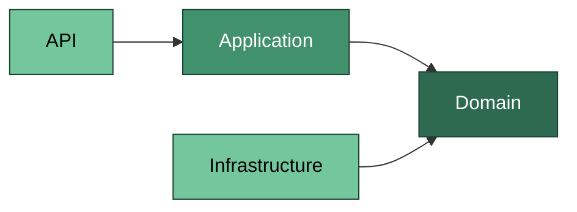
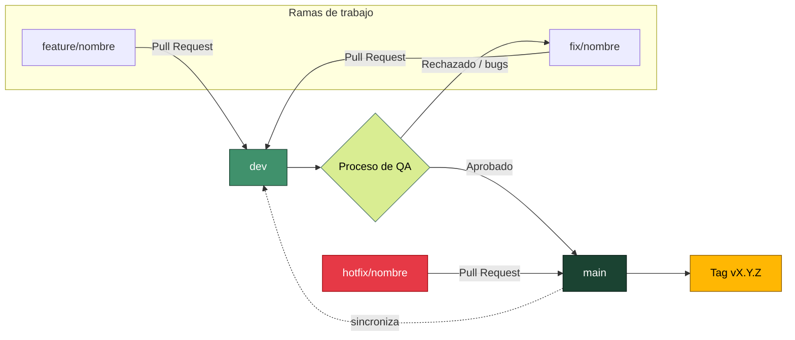

# Precotex Proyecto

## Objetivo

El objetivo principal de este proyecto es el desarrollo de una solución de software robusta, mantenible y escalable, construida bajo los principios de **Clean Architecture**. Precotex nace como una base técnica sólida que separa claramente las responsabilidades entre capas (Domain, Application, Infrastructure y API), facilitando la evolución del sistema, la incorporación de nuevos módulos de negocio y la aplicación de buenas prácticas de desarrollo como la inversión de dependencias, la validación centralizada y el acceso a datos desacoplado mediante Dapper.

## Arquitectura

El proyecto sigue el enfoque de **Clean Architecture**, organizado en las siguientes capas:

```
src/
├── Precotex.API               # Punto de entrada. Controllers, middlewares, configuración, inyección de dependencias.
├── Precotex.Application       # Casos de uso, DTOs, interfaces, validaciones, lógica de orquestación.
├── Precotex.Domain            # Entidades, agregados, value objects, enums y reglas de negocio puras.
└── Precotex.Infrastructure    # Implementación de acceso a datos (Dapper), servicios externos, persistencia.
```

**Regla de dependencia:** las capas internas (Domain) no dependen de ninguna otra capa. Application depende de Domain. Infrastructure y API dependen de Application y, a través de esta, de Domain. Ninguna capa interna conoce detalles de las capas externas.



## Tecnologías utilizadas

| Tecnología | Uso |
|---|---|
| .NET / C# | Lenguaje y framework principal |
| ASP.NET Core Web API | Capa de presentación / API REST |
| Dapper | Micro ORM para acceso a datos en la capa de Infrastructure |
| SQL Server | Motor de base de datos |
| xUnit / Moq (o equivalente) | Pruebas unitarias |
| Git / GitHub | Control de versiones |

## Flujo de trabajo con Git

El repositorio utiliza un flujo basado en dos ramas principales y un proceso de QA como puerta de calidad antes de llegar a producción:

- **`main`**: rama estable y desplegable. Solo recibe merges desde `dev` una vez que los cambios han pasado el proceso de QA. Representa el código en producción.
- **`dev`**: rama de integración. Aquí se integran todas las ramas de trabajo (features, mejoras, fixes) mediante Pull Request. Debe mantenerse siempre en un estado funcional y es la base sobre la que se ejecuta QA antes de promover a `main`.

### Diagrama del flujo



### Ramas de trabajo

Se mantienen solo tres tipos de rama, algo simple y fácil de recordar para todo el equipo:

| Prefijo | Uso | Se crea desde | Se fusiona a |
|---|---|---|---|
| `feature/<nombre>` | Nuevos requerimientos o funcionalidades | `dev` | `dev` (Pull Request) |
| `fix/<nombre>` | Corrección de bugs o incidencias detectadas en desarrollo o QA | `dev` | `dev` (Pull Request) |
| `hotfix/<nombre>` | Corrección urgente directamente sobre producción | `main` | `main` y luego se sincroniza con `dev` |

### Convención de nombres

```
feature/inventario-kardex
fix/validacion-stock-negativo
hotfix/error-conexion-bd
```

### Uso de Tags en producción

Cuando `dev` supera el proceso de QA y se fusiona a `main`, se debe crear un **tag** sobre ese commit para marcar la versión que queda en producción. Esto permite identificar qué código exacto está desplegado en cada momento y facilita volver a una versión anterior si algo falla.

Se recomienda usar versionado semántico básico `vMAJOR.MINOR.PATCH`:

- **MAJOR**: cambios grandes o incompatibles (ej. `v2.0.0`).
- **MINOR**: nuevas funcionalidades (ej. `v1.1.0`).
- **PATCH**: correcciones o hotfixes (ej. `v1.1.1`).

```bash
git checkout main
git pull origin main
git tag -a v1.1.0 -m "Release: incorporación de módulo de kardex"
git push origin v1.1.0
```

### Flujo general

1. Crear la rama de trabajo a partir de `dev`, usando el prefijo que corresponda según el tipo de cambio.

   *Ejemplo: se solicita un nuevo requerimiento para registrar el kardex de inventario.*
   ```bash
   git checkout dev
   git pull origin dev
   git checkout -b feature/inventario-kardex
   ```

2. Desarrollar y commitear los cambios siguiendo mensajes de commit claros y descriptivos.

   *Ejemplo:*
   ```bash
   git commit -m "Agrega endpoint para registrar movimientos de kardex"
   ```

3. Subir la rama y abrir un Pull Request hacia `dev`.

   *Ejemplo:*
   ```bash
   git push origin feature/inventario-kardex
   ```
   Luego se abre el Pull Request `feature/inventario-kardex → dev` en GitHub.

4. Una vez revisado y aprobado, se fusiona a `dev`.

   *Ejemplo: un compañero revisa el PR, deja comentarios menores, se corrigen y se aprueba el merge.*

5. Sobre `dev` se ejecuta el **proceso de QA**. Si se detecta un bug, se crea una rama `fix/<nombre>` a partir de `dev` para corregirlo y se repite el ciclo de Pull Request.

   *Ejemplo: QA reporta que el stock queda en negativo; se crea `fix/validacion-stock-negativo`, se corrige, se sube y se fusiona nuevamente a `dev`.*

6. Una vez que `dev` supera QA, se fusiona a `main` y se crea el **tag** correspondiente a la nueva versión estable.

   *Ejemplo: se fusiona `dev → main` y se etiqueta como `v1.1.0`.*

7. Ante un incidente crítico ya en producción, se crea una rama `hotfix/<nombre>` a partir de `main`; al resolverse, se fusiona a `main`, se etiqueta (ej. `v1.1.1`) y se sincroniza también con `dev`.

   *Ejemplo: en producción falla la conexión a la base de datos; se crea `hotfix/error-conexion-bd`, se corrige, se fusiona a `main` como `v1.1.1` y se sincroniza con `dev`.*

## Estructura de módulos

Cada módulo de negocio (Inventario, Ventas, Compras, Producción, etc.) respeta la misma organización por capas (API, Application, Domain, Infrastructure), promoviendo consistencia y facilidad de mantenimiento entre módulos.

## Requisitos previos

- .NET SDK (versión utilizada por el proyecto)
- SQL Server (local o remoto)
- Visual Studio 2022 / VS Code

## Cómo ejecutar el proyecto

```bash
git clone <url-del-repositorio>
cd Precotex.Proyecto
dotnet restore
dotnet build
dotnet run --project src/Precotex.API
```

Configurar la cadena de conexión a SQL Server en `appsettings.json` antes de ejecutar.
