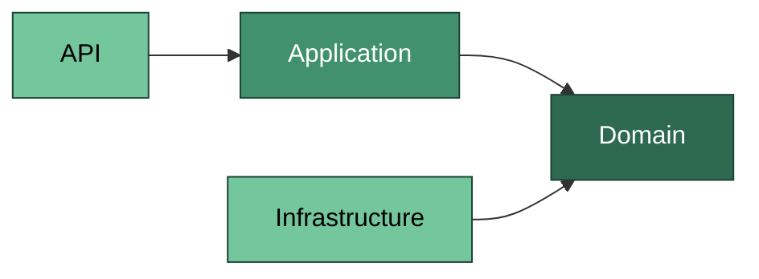
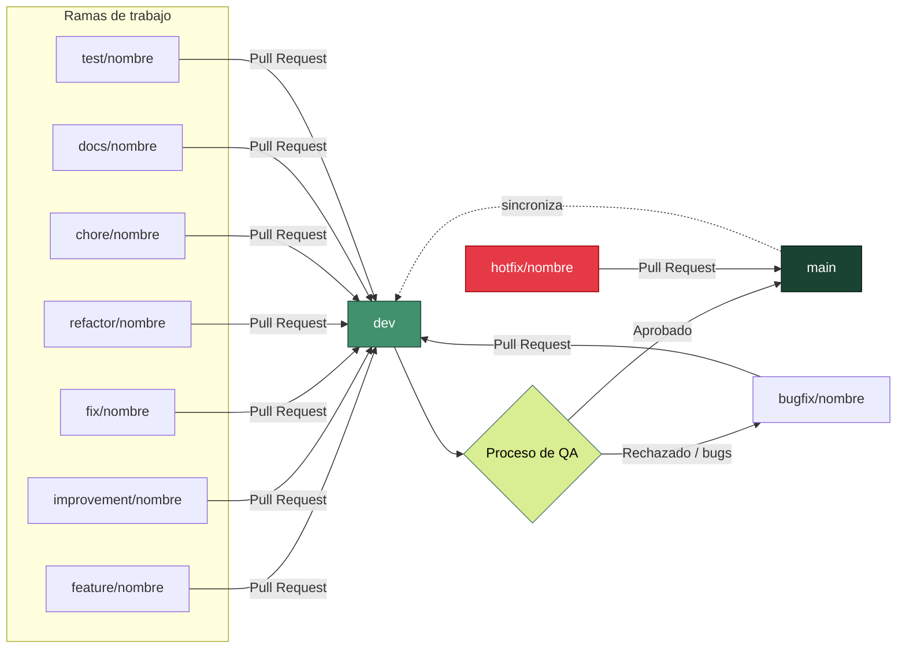

# Precotex.Proyecto

## Objetivo

El objetivo principal de este proyecto es el desarrollo de una solución de software robusta, mantenible y escalable, construida bajo los principios de **Clean Architecture**. Precotex nace como una base técnica sólida que separa claramente las responsabilidades entre capas (Domain, Application, Infrastructure y API), facilitando la evolución del sistema, la incorporación de nuevos módulos de negocio y la aplicación de buenas prácticas de desarrollo como la inversión de dependencias, la validación centralizada y el acceso a datos desacoplado mediante Dapper.

## Arquitectura

El proyecto sigue el enfoque de **Clean Architecture**, organizado en las siguientes capas:

```
src/
├── Precotex.API             # Punto de entrada. Controllers, middlewares, configuración, inyección de dependencias.
├── Precotex.Application      # Casos de uso, DTOs, interfaces, validaciones, lógica de orquestación.
├── Precotex.Domain            # Entidades, agregados, value objects, enums y reglas de negocio puras.
└── Precotex.Infrastructure    # Implementación de acceso a datos (Dapper), servicios externos, persistencia.
```

**Regla de dependencia:** las capas internas (Domain) no dependen de ninguna otra capa. Application depende de Domain. Infrastructure y API dependen de Application y, a través de esta, de Domain. Ninguna capa interna conoce detalles de las capas externas.



## Tecnologías utilizadas

| Tecnología | Uso |
|---|---|
| .NET / C# | Lenguaje y framework principal |
| ASP.NET Core Web API | Capa de presentación / API REST |
| Dapper | Micro ORM para acceso a datos en la capa de Infrastructure |
| SQL Server | Motor de base de datos |
| xUnit / Moq (o equivalente) | Pruebas unitarias |
| Git / GitHub | Control de versiones |

## Flujo de trabajo con Git (Branching)

El repositorio utiliza un flujo basado en dos ramas principales y un proceso de QA como puerta de calidad antes de llegar a producción:

- **`main`**: rama estable y desplegable. Solo recibe merges desde `dev` una vez que los cambios han pasado el proceso de QA. Representa el código en producción.
- **`dev`**: rama de integración. Aquí se integran todas las ramas de trabajo (features, mejoras, fixes) mediante Pull Request. Debe mantenerse siempre en un estado funcional y es la base sobre la que se ejecuta QA antes de promover a `main`.

### Diagrama del flujo



### Ramas de trabajo

| Prefijo | Uso | Se crea desde | Se fusiona a |
|---|---|---|---|
| `feature/<nombre>` | Desarrollo de una nueva funcionalidad | `dev` | `dev` (Pull Request) |
| `improvement/<nombre>` | Mejora sobre una funcionalidad ya existente | `dev` | `dev` (Pull Request) |
| `fix/<nombre>` | Corrección de un bug detectado durante el desarrollo | `dev` | `dev` (Pull Request) |
| `bugfix/<nombre>` | Corrección de un bug detectado durante el proceso de QA | `dev` | `dev` (Pull Request) |
| `refactor/<nombre>` | Refactorización de código sin cambio de comportamiento | `dev` | `dev` (Pull Request) |
| `chore/<nombre>` | Tareas de mantenimiento (dependencias, configuración, CI/CD) | `dev` | `dev` (Pull Request) |
| `docs/<nombre>` | Cambios o mejoras en documentación | `dev` | `dev` (Pull Request) |
| `test/<nombre>` | Incorporación o corrección de pruebas | `dev` | `dev` (Pull Request) |
| `hotfix/<nombre>` | Corrección urgente directamente sobre producción | `main` | `main` y luego se sincroniza con `dev` |

### Convención de nombres

```
feature/inventario-kardex
improvement/optimizacion-consulta-reportes
fix/validacion-stock-negativo
bugfix/error-calculo-total-qa
refactor/servicio-autenticacion
chore/actualizacion-paquetes-nuget
docs/actualizacion-readme
test/cobertura-casos-uso-producto
hotfix/error-conexion-bd
```

### Flujo general

1. Crear la rama de trabajo a partir de `dev`, usando el prefijo que corresponda según el tipo de cambio:
   ```bash
   git checkout dev
   git pull origin dev
   git checkout -b feature/nombre-del-feature
   ```
2. Desarrollar y commitear los cambios siguiendo mensajes de commit claros y descriptivos.
3. Subir la rama y abrir un Pull Request hacia `dev`.
4. Una vez revisado y aprobado, se fusiona a `dev`.
5. Sobre `dev` se ejecuta el **proceso de QA**. Si se detectan errores, se crea una rama `bugfix/<nombre>` a partir de `dev` para corregirlos y se repite el ciclo de Pull Request.
6. Una vez que `dev` supera QA, se fusiona a `main` para generar una nueva versión estable en producción.
7. Ante un incidente crítico en producción, se crea una rama `hotfix/<nombre>` a partir de `main`; al resolverse, se fusiona a `main` y se sincroniza también con `dev`.

## Estructura de módulos

Cada módulo de negocio (Inventario, Ventas, Compras, Producción, etc.) respeta la misma organización por capas (API, Application, Domain, Infrastructure), promoviendo consistencia y facilidad de mantenimiento entre módulos.

## Requisitos previos

- .NET SDK (versión utilizada por el proyecto)
- SQL Server (local o remoto)
- Visual Studio 2022 / VS Code

## Cómo ejecutar el proyecto

```bash
git clone <url-del-repositorio>
cd Precotex.Proyecto
dotnet restore
dotnet build
dotnet run --project src/Precotex.API
```

Configurar la cadena de conexión a SQL Server en `appsettings.json` antes de ejecutar.
