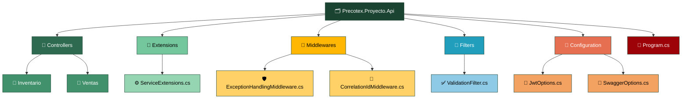

# Precotex.Proyecto.Api

Punto de entrada de la solución. Depende de `Precotex.Proyecto.Application` → `Precotex.Proyecto.Domain`. Sin lógica de negocio: solo expone, valida y traduce.

## Estructura



## Carpeta → contenido → SOLID

| Carpeta | Contiene | SOLID |
|---|---|---|
| `Controllers/{Modulo}/` | Controllers por módulo de negocio | SRP / DIP |
| `Extensions/ServiceExtensions.cs` | Todos los `AddXxx()` del proyecto | SRP |
| `Middlewares/` | Excepciones, correlación de requests | SRP |
| `Filters/` | Validación, auditoría por acción | SRP |
| `Configuration/` | POCOs para `IOptions<T>` | SRP |
| `Program.cs` | Composition root | — |

`Program.cs` queda así de simple:

```csharp
builder.Services.AddApplicationServices();
builder.Services.AddInfrastructureServices(builder.Configuration);
builder.Services.AddSwaggerConfig();
builder.Services.AddAuthConfig(builder.Configuration);
builder.Services.AddCorsConfig();

app.UseExceptionHandlingMiddleware();
app.MapControllers();
```

Ver arquitectura general en [docs/arquitectura.md](../../docs/arquitectura.md).
