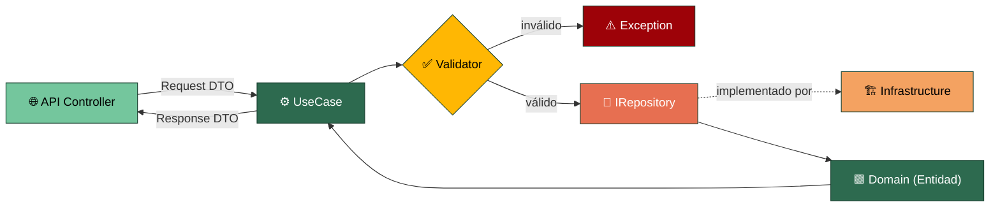

# Precotex.Proyecto.Application

Depende de `Precotex.Proyecto.Domain`. No conoce a `Precotex.Proyecto.Api` ni a `Precotex.Proyecto.Infrastructure`: define **qué** se necesita (interfaces), nunca **cómo** se resuelve.

Ver detalle general de la arquitectura en [docs/arquitectura.md](../../docs/arquitectura.md).

## Estructura

```mermaid
flowchart TD
    ROOT[🗂️ Precotex.Proyecto.Application]
    ROOT --> UC[📁 UseCases]
    UC --> UCINV[📁 Inventario]
    UC --> UCVEN[📁 Ventas]
    UC --> UCCOM[📁 Compras]
    UC --> UCPRO[📁 Produccion]
    ROOT --> DTO[📁 DTOs]
    DTO --> DTOREQ[📄 Request]
    DTO --> DTORES[📄 Response]
    ROOT --> INT[📁 Interfaces]
    INT --> INTREPO[🔌 IRepository]
    INT --> INTSVC[🔌 IServicioExterno]
    ROOT --> VAL[📁 Validators]
    VAL --> VALF[✅ FluentValidation]
    ROOT --> MAP[📁 Mappings]
    MAP --> MAPF[🔁 Profiles / Mappers]
    ROOT --> COM[📁 Common]
    COM --> COMEX[⚠️ Exceptions]
    COM --> COMRE[📦 Result / Response wrapper]

    style ROOT fill:#1b4332,stroke:#1b4332,color:#fff
    style UC fill:#2d6a4f,stroke:#1b4332,color:#fff
    style UCINV fill:#40916c,stroke:#1b4332,color:#fff
    style UCVEN fill:#40916c,stroke:#1b4332,color:#fff
    style UCCOM fill:#40916c,stroke:#1b4332,color:#fff
    style UCPRO fill:#40916c,stroke:#1b4332,color:#fff
    style DTO fill:#219ebc,stroke:#1b4332,color:#fff
    style DTOREQ fill:#8ecae6,stroke:#1b4332,color:#000
    style DTORES fill:#8ecae6,stroke:#1b4332,color:#000
    style INT fill:#e76f51,stroke:#1b4332,color:#fff
    style INTREPO fill:#f4a261,stroke:#1b4332,color:#000
    style INTSVC fill:#f4a261,stroke:#1b4332,color:#000
    style VAL fill:#ffb703,stroke:#1b4332,color:#000
    style VALF fill:#ffd166,stroke:#1b4332,color:#000
    style MAP fill:#7209b7,stroke:#1b4332,color:#fff
    style MAPF fill:#b298dc,stroke:#1b4332,color:#000
    style COM fill:#9d0208,stroke:#1b4332,color:#fff
    style COMEX fill:#e5989b,stroke:#1b4332,color:#000
    style COMRE fill:#e5989b,stroke:#1b4332,color:#000
```

## Flujo: ejecución de un caso de uso

El caso de uso es el único punto de entrada a la lógica de negocio para el mundo exterior. Nunca conoce Dapper, EF ni ningún detalle de infraestructura: solo conoce **interfaces**, que `Infrastructure` implementa por inyección de dependencias.

Application **define** `IRepository`; `Infrastructure` lo **implementa**. Si el caso de uso necesitara conocer la clase concreta (`DapperPedidoRepository`), la dependencia estaría invertida y rompería la regla de la arquitectura.

## Carpeta → contenido → SOLID

| Carpeta | Contiene | SOLID |
|---|---|---|
| `UseCases/{Modulo}/` | Un caso de uso = una acción de negocio (`CrearPedidoUseCase`, `AprobarCompraUseCase`) | SRP |
| `DTOs/` | Objetos planos de entrada/salida, sin lógica | SRP |
| `Interfaces/` | Contratos que implementa Infrastructure (repositorios, servicios externos) | DIP / ISP |
| `Validators/` | Reglas de validación de entrada, separadas del caso de uso | SRP |
| `Mappings/` | Conversión Entidad ↔ DTO | SRP |
| `Common/` | Excepciones propias de la capa, wrapper de resultado (`Result<T>`) | SRP |

## Principios SOLID básicos

| Principio | Concepto básico | En esta capa |
|---|---|---|
| **S** — Single Responsibility | Una clase debe tener una única razón para cambiar | Cada `UseCase` resuelve una sola acción de negocio; no mezcla creación, validación externa ni reportes en la misma clase |
| **O** — Open/Closed | Abierta a extensión, cerrada a modificación | Un caso de uso nuevo se agrega como clase nueva; no se llena de `if` un caso de uso existente para soportar variantes |
| **L** — Liskov Substitution | Un subtipo debe poder usarse donde se espera el tipo base, sin romper el comportamiento | Cualquier implementación de `IExportadorReporte` (PDF, Excel) debe funcionar igual para quien la consume, sin sorpresas |
| **I** — Interface Segregation | Interfaces pequeñas y específicas, no una sola con de todo | `IPedidoLector` y `IPedidoEscritor` en vez de un `IPedidoRepository` gigante si los consumidores no usan todo |
| **D** — Dependency Inversion | Depender de abstracciones, no de implementaciones concretas | El `UseCase` depende de `IRepository` (definida aquí), nunca de la clase concreta que vive en Infrastructure |

## Checklist antes de un PR sobre Application

- [ ] ¿El caso de uso nuevo depende solo de `Domain` y de interfaces propias, nunca de tipos de Infrastructure (Dapper, EF, HttpClient concreto)?
- [ ] ¿La validación de entrada vive en un `Validator`, no mezclada dentro del caso de uso?
- [ ] ¿El DTO de salida no expone directamente la entidad de Domain?
- [ ] ¿Un caso de uso hace una sola cosa, o debería dividirse en dos?
- [ ] ¿La interfaz nueva es lo más pequeña posible para lo que el consumidor realmente necesita?
