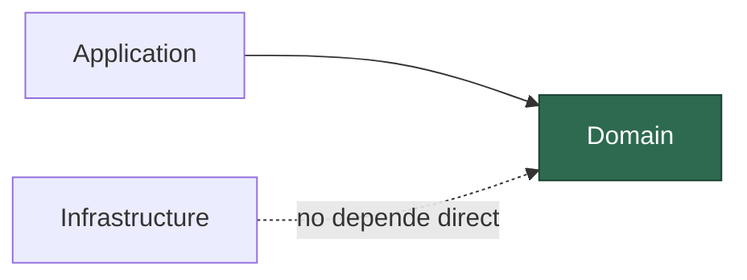
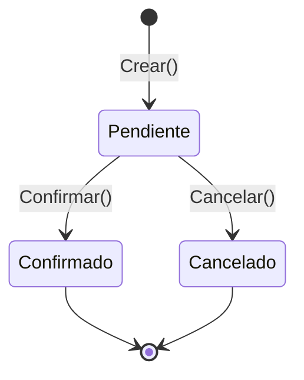

# Precotex.Proyecto.Domain

Capa más interna de la arquitectura. **No depende de ninguna otra capa** (ni de Application, ni de Infrastructure, ni de API, ni de librerías externas como Dapper o EF).

Ver detalle general de la arquitectura en [docs/arquitectura.md](../../docs/arquitectura.md).

> Regla simple para saber si algo va aquí: **si necesitas un `using` hacia Application, Infrastructure o un paquete de acceso a datos, esa clase no pertenece a Domain.**

## Contenido

| Carpeta | Qué va aquí | Ejemplo |
|---|---|---|
| `Entities/` | Objetos con identidad (`Id`) y reglas propias | `Cliente`, `Pedido`, `Producto` |
| `Enums/` | Catálogos cerrados de valores del negocio | `EstadoPedido`, `TipoCliente` |
| `Interfaces/` | Contratos que pertenecen al negocio, no a infraestructura | `IReglaDescuento`, `IValidable` |

Por ahora **no** se usan Value Objects, Agregados, Excepciones de dominio ni Domain Events en este proyecto. Si en el futuro se necesitan, se documentan aquí antes de introducirlos.

## Flujo: ciclo de vida de una entidad

La entidad es responsable de controlar sus propias transiciones de estado. Solo los caminos definidos por la propia clase son válidos; cualquier otro salto no existe en el modelo.

Confirmado y Cancelado no tienen salida entre sí: la propia entidad impide, por diseño, pasar de `Confirmado` a `Cancelado` directamente. Esa restricción vive en el método de la entidad, no en quien la llama.

## Principios SOLID básicos

| Principio | Concepto básico | En esta capa |
|---|---|---|
| **S** — Single Responsibility | Una clase debe tener una única razón para cambiar | La entidad solo conoce sus reglas de negocio, no cómo se guarda ni cómo se muestra |
| **O** — Open/Closed | Abierta a extensión, cerrada a modificación | Una regla nueva se agrega como caso adicional, sin reescribir la lógica existente |
| **L** — Liskov Substitution | Un subtipo debe poder usarse donde se espera el tipo base, sin romper el comportamiento | `ClienteVip` debe comportarse como un `Cliente` válido, no lanzar errores inesperados |
| **I** — Interface Segregation | Interfaces pequeñas y específicas, no una sola con de todo | `IValidable` valida, `ICalculable` calcula; no una interfaz que mezcle ambas responsabilidades |
| **D** — Dependency Inversion | Depender de abstracciones, no de implementaciones concretas | Domain no depende de nada; Application e Infrastructure dependen de él (ver diagrama al inicio) |

## Checklist antes de un PR sobre Domain

- [ ] ¿La clase nueva solo depende de tipos del propio proyecto Domain (o de `System.*`)?
- [ ] ¿Las reglas de negocio están validadas dentro de la entidad, no en el controller/caso de uso?
- [ ] ¿El estado se modifica con métodos de negocio (`Confirmar()`, `Cancelar()`) y no con setters públicos sueltos?
- [ ] ¿Evité agregar Value Objects, Agregados, Excepciones de dominio o Events sin acordarlo antes?
