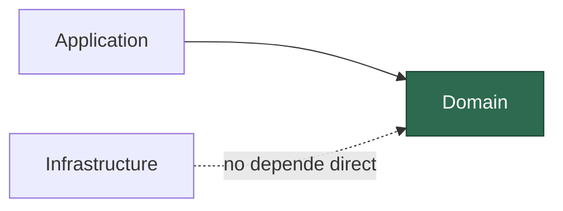
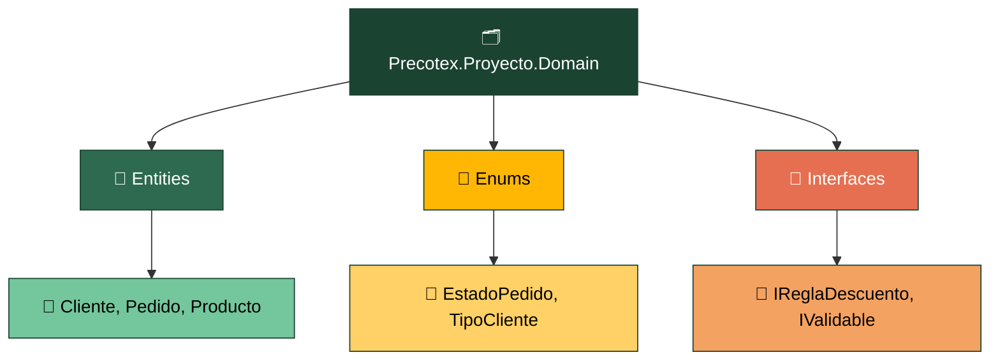
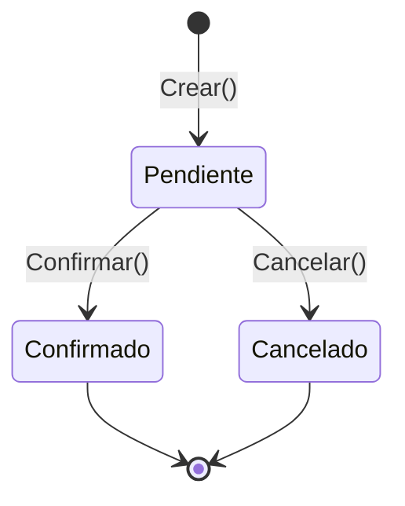

# Precotex.Proyecto.Domain

Capa más interna de la arquitectura. **No depende de ninguna otra capa** (ni de Application, ni de Infrastructure, ni de API, ni de librerías externas como Dapper o EF).

> Regla simple para saber si algo va aquí: **si necesitas un `using` hacia Application, Infrastructure o un paquete de acceso a datos, esa clase no pertenece a Domain.**

## Estructura

## Flujo: ciclo de vida de una entidad

La entidad es responsable de controlar sus propias transiciones de estado. Solo los caminos definidos por la propia clase son válidos; cualquier otro salto no existe en el modelo.

Confirmado y Cancelado no tienen salida entre sí: la propia entidad impide, por diseño, pasar de `Confirmado` a `Cancelado` directamente. Esa restricción vive en el método de la entidad, no en quien la llama.

## Carpeta → contenido → SOLID

| Carpeta | Contiene | SOLID |
|---|---|---|
| `Entities/` | Objetos con identidad (`Id`) y reglas propias de negocio | SRP / OCP / LSP |
| `Enums/` | Catálogos cerrados de valores del negocio | — |
| `Interfaces/` | Contratos que pertenecen al negocio, no a infraestructura | ISP / DIP |

Por ahora **no** se usan Value Objects, Agregados, Excepciones de dominio ni Domain Events en este proyecto. Si en el futuro se necesitan, se documentan aquí antes de introducirlos.

## Checklist antes de un PR sobre Domain

- [ ] ¿La clase nueva solo depende de tipos del propio proyecto Domain (o de `System.*`)?
- [ ] ¿Las reglas de negocio están validadas dentro de la entidad, no en el controller/caso de uso?
- [ ] ¿El estado se modifica con métodos de negocio (`Confirmar()`, `Cancelar()`) y no con setters públicos sueltos?
- [ ] ¿Evité agregar Value Objects, Agregados, Excepciones de dominio o Events sin acordarlo antes?

Ver detalle general de la arquitectura en [docs/arquitectura.md](../../docs/arquitectura.md).
