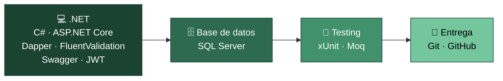

# Precotex Proyecto

Este repositorio es la plantilla oficial para los proyectos Backend de Precotex.
Todo nuevo proyecto debe partir desde esta estructura.

## Objetivo

Proporcionar una plantilla estándar para el desarrollo de proyectos Backend basada en Clean Architecture, promoviendo una separación clara de responsabilidades, mantenibilidad, escalabilidad y buenas prácticas de desarrollo.

## Arquitectura

El proyecto sigue el enfoque de **Clean Architecture**, organizado en capas (API, Application, Domain, Infrastructure) con una regla de dependencia estricta hacia el Domain.

Ver detalle completo en [docs/arquitectura.md](docs/arquitectura.md).

## Tecnologías utilizadas

El stack se organiza según el momento del ciclo de trabajo en el que interviene: desarrollo en .NET, base de datos, testing y entrega de versiones.



| Tecnología | Etapa | Uso en el proyecto |
|---|---|---|
| .NET / C# | .NET | Lenguaje y runtime base de las cuatro capas |
| ASP.NET Core Web API | .NET | Capa de presentación (`Precotex.Proyecto.Api`): controllers, middlewares, filters |
| Dapper | .NET | Acceso a datos en `Infrastructure` (`DapperContext`, repositorios); nunca expone sus tipos fuera de esa capa |
| FluentValidation | .NET | Reglas de validación de entrada en `Application/Validators` |
| Swagger / Swashbuckle | .NET | Documentación interactiva de la API (`SwaggerOptions.cs`, `AddSwaggerConfig()`) |
| JWT | .NET | Autenticación de la API (`JwtOptions.cs`, `AddAuthConfig()`) |
| SQL Server | Base de datos | Motor de base de datos consumido a través de `Infrastructure` |
| xUnit / Moq | Testing | Pruebas unitarias por capa y dobles de prueba para dependencias externas |
| Git / GitHub | Entrega | Ramas `feature`/`fix`/`hotfix`, Pull Requests a `dev` y tags de versión en `main` |

> La solución todavía no incluye los proyectos de pruebas (`.csproj`) creados: xUnit y Moq quedan fijados aquí como el estándar del proyecto. Ver la estructura planificada, la pirámide de pruebas y su relación con SOLID en [tests/README.md](tests/README.md).

Ver detalle completo del flujo de entrega en [docs/flujo-git.md](docs/flujo-git.md).

## Flujo de trabajo con Git

El repositorio utiliza un flujo basado en dos ramas principales (`main`, `dev`) y un proceso de QA como puerta de calidad antes de llegar a producción, con ramas `feature/`, `fix/` y `hotfix/`.

Ver detalle completo en [docs/flujo-git.md](docs/flujo-git.md).

## Requisitos previos

- .NET SDK (versión utilizada por el proyecto)
- SQL Server (local o remoto)
- Visual Studio 2022 / VS Code

## Cómo ejecutar el proyecto

```bash
git clone <url-del-repositorio>
cd Precotex.Proyecto
dotnet restore
dotnet build
dotnet run --project src/Precotex.API
```

Configurar la cadena de conexión a SQL Server en `appsettings.json` antes de ejecutar.
