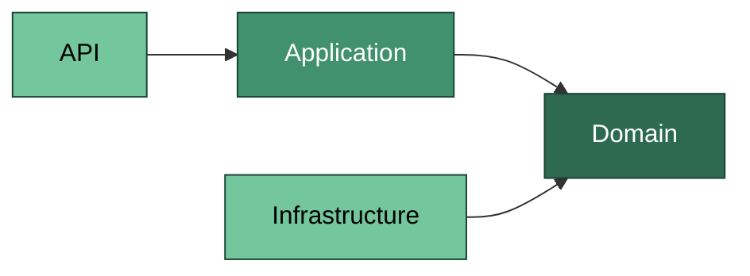

# Arquitectura

El proyecto sigue el enfoque de **Clean Architecture**, organizado en las siguientes capas:

```
src/
├── Precotex.API               # Punto de entrada. Controllers, middlewares, configuración, inyección de dependencias.
├── Precotex.Application       # Casos de uso, DTOs, interfaces, validaciones, lógica de orquestación.
├── Precotex.Domain            # Entidades, agregados, value objects, enums y reglas de negocio puras.
└── Precotex.Infrastructure    # Implementación de acceso a datos (Dapper), servicios externos, persistencia.
```

**Regla de dependencia:** las capas internas (Domain) no dependen de ninguna otra capa. Application depende de Domain. API depende de Application y, a través de esta, de Domain. Infrastructure depende directamente de Domain (implementa sus contratos de persistencia, `IRepository`) y de Application (implementa sus contratos de orquestación). Ninguna capa interna conoce detalles de las capas externas.

Los contratos de repositorio (`IRepository`) se definen en Domain, porque describen operaciones sobre sus propias entidades; los contratos de orquestación (servicios externos, notificaciones) se definen en Application. Infrastructure implementa ambos.



## Estructura de módulos

Cada módulo de negocio (Inventario, Ventas, Compras, Producción, etc.) respeta la misma organización por capas (API, Application, Domain, Infrastructure), promoviendo consistencia y facilidad de mantenimiento entre módulos.
