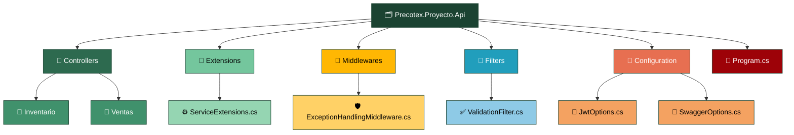
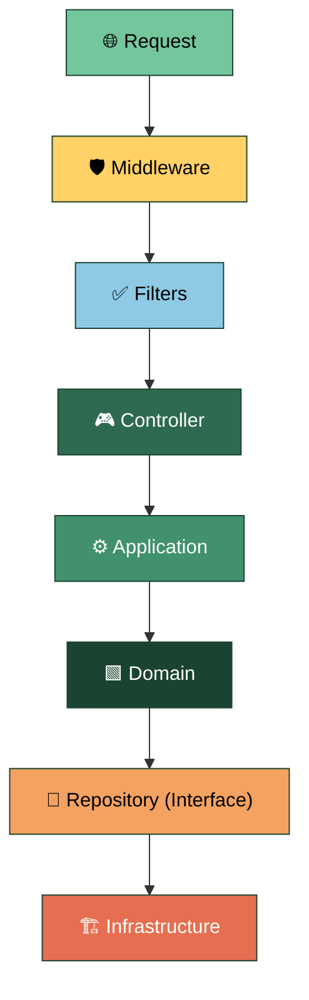

# Precotex Proyecto Api

Punto de entrada de la aplicación.
Su responsabilidad es recibir las solicitudes, validar la información de entrada, delegar los casos de uso y devolver la respuesta al cliente.
No contiene lógica de negocio.

## Estructura



## Flujo: ejecución de un caso de uso

El request atraviesa la pipeline en orden: entra por los middlewares, pasa los filters, llega al controller y de ahí baja capa por capa hasta infraestructura.

El controller nunca contiene lógica de negocio ni conoce detalles de infraestructura.



## Responsabilidades de la capa

| Carpeta | Contiene | SOLID |
|---|---|---|
| `Controllers/{Modulo}/` | Controllers por módulo de negocio | SRP / DIP |
| `Extensions/ServiceExtensions.cs` | Todos los `AddXxx()` del proyecto | SRP |
| `Middlewares/` | Excepciones | SRP |
| `Filters/` | Validación, auditoría por acción | SRP |
| `Configuration/` | POCOs para `IOptions<T>` | SRP |
| `Program.cs` | Composition root | — |


## Composition Root

La configuración principal de la aplicación se concentra en `Program.cs`, delegando el registro de servicios a métodos de extensión.

```csharp
builder.Services.AddApplicationServices();
builder.Services.AddInfrastructureServices(builder.Configuration);
builder.Services.AddSwaggerConfig();
builder.Services.AddAuthConfig(builder.Configuration);
builder.Services.AddCorsConfig();

app.UseExceptionHandlingMiddleware();
app.MapControllers();
```

---

## Qué NO pertenece aquí

| No colocar | Corresponde a |
|---|---|
| Reglas de negocio | `Domain` |
| Orquestación de casos de uso | `Application` |
| Acceso a datos | `Infrastructure` |
| Interfaces de repositorio | `Domain` |
| Validaciones de dominio | `Domain` |
| Mapeo directo de entidades | `Application` |

---


## Dependencias

La capa API puede depender de:

- Application
- Domain (opcional para contratos compartidos)

No debe depender de implementaciones de Infrastructure.

---

Ver arquitectura general en [docs/arquitectura.md](../../docs/arquitectura.md).
