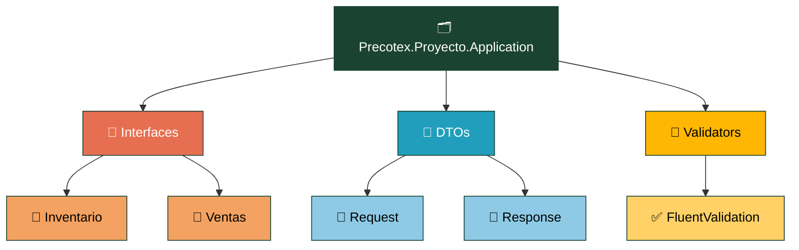
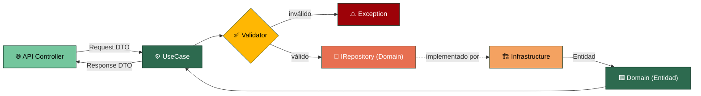

# Precotex Proyecto Application

Depende de `Precotex.Proyecto.Domain`. No conoce a `Precotex.Proyecto.Api` ni a `Precotex.Proyecto.Infrastructure`: define **qué** se necesita para orquestar casos de uso (interfaces de servicios), nunca **cómo** se resuelve. Los contratos de persistencia (`IRepository`) no viven aquí: los define `Domain`, porque describen operaciones sobre sus propias entidades.

Ver detalle general de la arquitectura en [docs/arquitectura.md](../../docs/arquitectura.md).

## Estructura

## Flujo: ejecución de un caso de uso

El caso de uso es el único punto de entrada a la lógica de negocio para el mundo exterior. Nunca conoce Dapper, EF ni ningún detalle de infraestructura: solo conoce **interfaces**, que `Infrastructure` implementa por inyección de dependencias.

`Domain` **define** `IRepository`; `Infrastructure` lo **implementa**; `Application` (el `UseCase`) solo lo **consume** por inyección de dependencias, sin conocer la implementación concreta. Si el caso de uso necesitara conocer la clase concreta (`DapperPedidoRepository`), la dependencia estaría invertida y rompería la regla de la arquitectura.

## Carpeta → contenido → SOLID

| Carpeta | Contiene | SOLID |
|---|---|---|
| `Interfaces/{Modulo}/` | Contratos propios de orquestación (servicios externos, notificaciones) que implementa Infrastructure, organizados por módulo de negocio — los repositorios (`IRepository`) viven en `Domain` | DIP / ISP |
| `DTOs/` | Objetos planos de entrada/salida, sin lógica | SRP |
| `Validators/` | Reglas de validación de entrada | SRP |

## Alcance

| Corresponde a esta capa | No corresponde (¿dónde va?) |
|---|---|
| Orquestar un caso de uso (`UseCase`): coordinar entidades, repositorios y servicios externos | Reglas de negocio / invariantes de una entidad → `Domain` |
| Definir DTOs de entrada/salida (`Request`/`Response`) | Detalles de implementación de infraestructura (Dapper, SQL, HttpClient concreto) → `Infrastructure` |
| Validar la forma del request (`FluentValidation`: requeridos, formatos, rangos) | Tipos de ASP.NET Core (`HttpContext`, `IActionResult`, atributos de Controller) → `Api` |
| Definir interfaces de orquestación (servicios externos, notificaciones) que implementa `Infrastructure` | Contratos de persistencia (`IRepository`) → `Domain`, porque describen operaciones sobre sus propias entidades |
| Mapear entre DTO y Entidad de `Domain` | Decidir si un cambio de estado es válido para el negocio (eso lo decide la propia entidad) |
| Conocer la interfaz `IRepository` (nunca su implementación concreta) | Código HTTP, formato de respuesta, códigos de estado |

**Señal de alarma:** si un `UseCase` necesita un `using` hacia `Precotex.Proyecto.Infraestructure`, algo se rompió: solo debe conocer interfaces, nunca implementaciones concretas.
