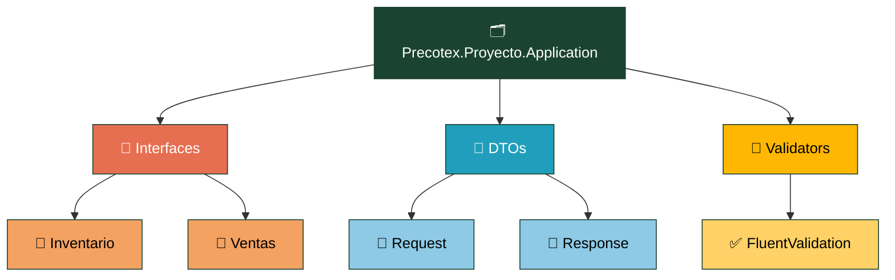
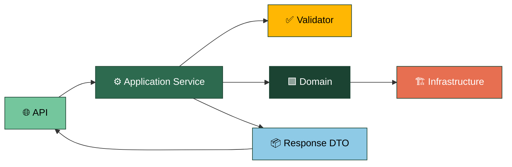

# Precotex Proyecto Application

## Descripción

Capa encargada de orquestar los casos de uso del sistema.
Define contratos de servicios consumidos por la API, gestiona DTOs de entrada/salida y coordina operaciones con Domain mediante sus contratos.
No contiene lógica de infraestructura ni reglas propias del dominio.

## Estructura

---

## Responsabilidades

| Carpeta | Responsabilidad |
|---|---|
| `Interfaces/{Modulo}/` | Contratos de servicios de aplicación que exponen los casos de uso consumidos por la API. |
| `DTOs/` | Modelos de entrada y salida entre API y Application. |
| `Validators/` | Validación de datos de entrada mediante FluentValidation. |

---

## Flujo

La API invoca al `Application Service` (el `UseCase`). Este valida el request con el `Validator`, coordina operaciones con `Domain` y utiliza contratos definidos por este, cuya implementación corresponde a `Infrastructure`. y arma el `Response DTO` que retorna a la API.

---

## Casos de Uso

Los servicios de Application representan las acciones disponibles para la API.

Cada servicio:
- recibe información mediante DTOs
- valida la entrada
- coordina operaciones con Domain
- devuelve resultados al consumidor

---

## Dependencias

La capa Application puede depender de:

- Domain

No conoce:

- API
- Infrastructure
- Persistencia
- Detalles externos

---

## Qué NO pertenece aquí

| No colocar | Corresponde a |
|---|---|
| Reglas e invariantes de negocio | `Domain` |
| Dapper, SQL, `HttpClient` concreto | `Infrastructure` |
| `HttpContext`, `IActionResult` | `Api` |
| Definición de `IRepository` | `Domain` |
| Código HTTP, formato de respuesta | `Api` |

---

## Referencias

Ver arquitectura general en [docs/arquitectura.md](../../docs/arquitectura.md).
