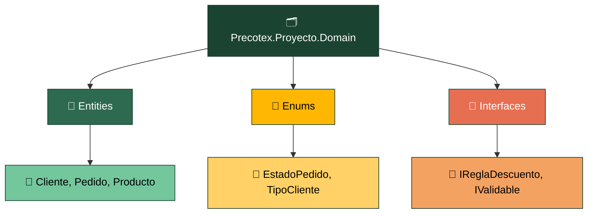
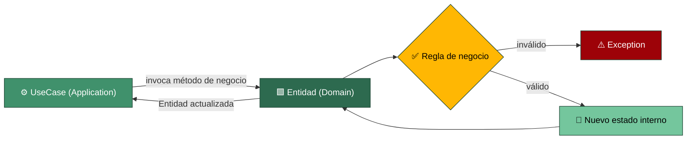

# Precotex Proyecto Domain

Capa más interna de la arquitectura. **No depende de ninguna otra capa** (ni de Application, ni de Infrastructure, ni de API, ni de librerías externas como Dapper o EF).

> Regla simple para saber si algo va aquí: **si necesitas un `using` hacia Application, Infrastructure o un paquete de acceso a datos, esa clase no pertenece a Domain.**

## Estructura

## Flujo: ejecución de un caso de uso

Domain es el último eslabón de la cadena API → Application → Domain. No conoce el `UseCase` que lo invoca, ni el Request/Response DTO, ni Dapper/EF: solo expone métodos de negocio y protege sus propias invariantes.

El `UseCase` le entrega a la entidad los datos ya validados en forma primitiva; la entidad decide si el cambio de estado es válido según sus propias reglas. Si no lo es, la excepción que lanza remonta hasta `Application` y de ahí hasta el `ExceptionHandlingMiddleware` de `Api`. Domain nunca valida el DTO de entrada ni sabe quién lo llamó: solo conoce sus propias reglas de negocio.

## Carpeta → contenido → SOLID

| Carpeta | Contiene | SOLID |
|---|---|---|
| `Entities/` | Objetos con identidad (`Id`) y reglas propias de negocio | SRP / OCP / LSP |
| `Enums/` | Catálogos cerrados de valores del negocio | — |
| `Interfaces/` | Contratos que pertenecen al negocio, no a infraestructura | ISP / DIP |

Por ahora **no** se usan Value Objects, Agregados, Excepciones de dominio ni Domain Events en este proyecto. Si en el futuro se necesitan, se documentan aquí antes de introducirlos.

Ver detalle general de la arquitectura en [docs/arquitectura.md](../../docs/arquitectura.md).
