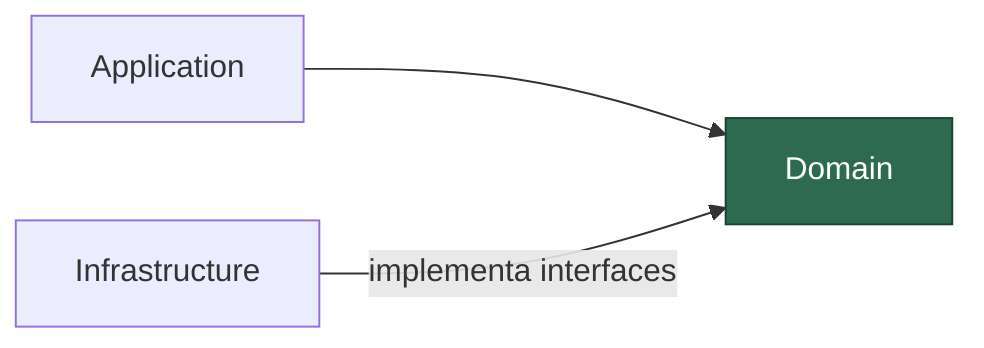
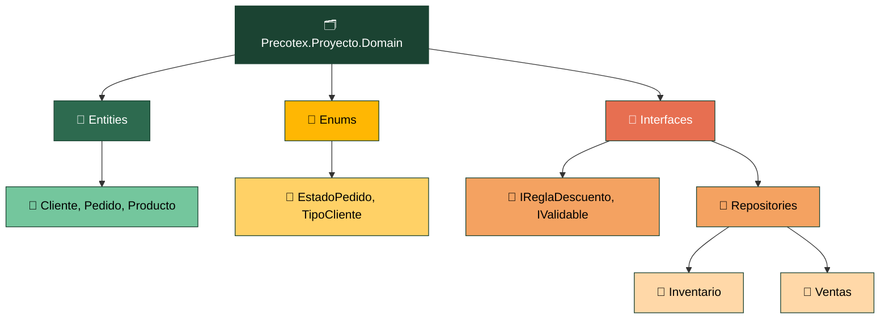
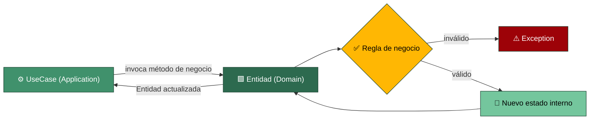

# Precotex Proyecto Domain

Capa más interna de la arquitectura. **No depende de ninguna otra capa** (ni de Application, ni de Infrastructure, ni de API, ni de librerías externas como Dapper o EF).

> Regla simple para saber si algo va aquí: **si necesitas un `using` hacia Application, Infrastructure o un paquete de acceso a datos, esa clase no pertenece a Domain.**

## Estructura

## Flujo: ejecución de un caso de uso

Domain es el último eslabón de la cadena API → Application → Domain. No conoce el `UseCase` que lo invoca, ni el Request/Response DTO, ni Dapper/EF: solo expone métodos de negocio y protege sus propias invariantes.

Los contratos de persistencia (`Interfaces/Repositories/{Modulo}`, ej. `IPedidoRepository`) también viven en Domain: describen operaciones sobre sus propias entidades, por lo que el dominio es quien debe definirlas. Domain nunca los invoca ni los referencia en tiempo de ejecución — solo `Application` los consume (inyectados) e `Infrastructure` los implementa.

El `UseCase` le entrega a la entidad los datos ya validados en forma primitiva; la entidad decide si el cambio de estado es válido según sus propias reglas. Si no lo es, la excepción que lanza remonta hasta `Application` y de ahí hasta el `ExceptionHandlingMiddleware` de `Api`. Domain nunca valida el DTO de entrada ni sabe quién lo llamó: solo conoce sus propias reglas de negocio.

## Carpeta → contenido → SOLID

| Carpeta | Contiene | SOLID |
|---|---|---|
| `Entities/` | Objetos con identidad (`Id`) y reglas propias de negocio | SRP / OCP / LSP |
| `Enums/` | Catálogos cerrados de valores del negocio | — |
| `Interfaces/` | Contratos de reglas de negocio puras (`IReglaDescuento`, `IValidable`) | ISP / DIP |
| `Interfaces/Repositories/{Modulo}/` | Contratos de persistencia (`IPedidoRepository`, `IProductoRepository`, etc.) que `Infrastructure` implementa, organizados por módulo de negocio | DIP / ISP |

Por ahora **no** se usan Value Objects, Agregados, Excepciones de dominio ni Domain Events en este proyecto. Si en el futuro se necesitan, se documentan aquí antes de introducirlos.

## Alcance

| ✅ Sí | 🚫 No → capa |
|---|---|
| Entidades con reglas propias, protegen su estado | DTOs de entrada/salida → `Application` |
| Enums / catálogos cerrados | Orquesta varias entidades/repos → `Application` |
| Interfaces de reglas puras (`IReglaDescuento`, `IValidable`) | Valida formato de entrada → `Application` |
| Contratos `IRepository` (dueño de sus propias entidades) | Implementa acceso a datos → `Infrastructure` |
| Futuro: Value Objects, Domain Events, excepciones de dominio | `using` hacia Application, Infrastructure o Api |
| — | Dapper, EF, FluentValidation, ASP.NET Core |

**Alarma:** clase con `using` externo a Domain. No pertenece aquí (ver regla al inicio).

Ver detalle general de la arquitectura en [docs/arquitectura.md](../../docs/arquitectura.md).
