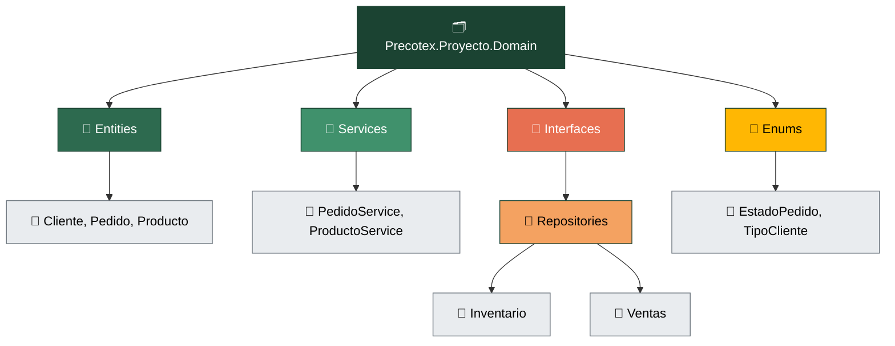
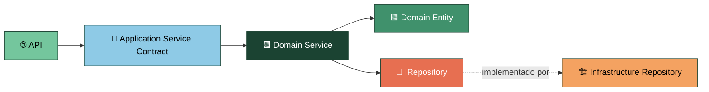
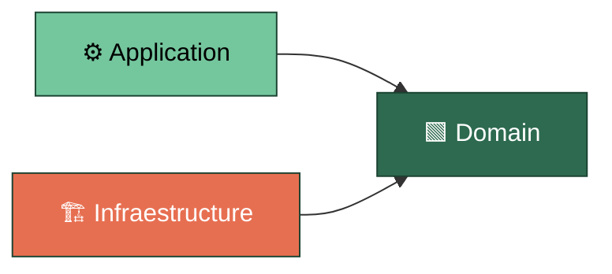

# Precotex Proyecto Domain

## Descripción

Capa central de la solución donde se implementan las reglas del negocio y los servicios que ejecutan los casos de uso definidos por Application.
Contiene entidades, contratos de persistencia y lógica de dominio.
No contiene detalles de infraestructura como Dapper, EF, SQL o acceso HTTP.

## Estructura

---

## Responsabilidades

| Carpeta | Responsabilidad |
|---|---|
| `Entities/` | Entidades con identidad y comportamiento propio del negocio |
| `Enums/` | Valores cerrados definidos por el negocio | 
| `Services/` | Implementación de servicios definidos por Application para ejecutar casos de uso |
| `Interfaces/Repositories/{Modulo}/` | Contratos de persistencia que Infrastructure implementa |

---

## Flujo

La `API` consume el contrato de servicio definido en `Application`.
`Domain` implementa ese contrato y coordina las entidades del dominio, aplicando las reglas necesarias.
Cuando requiere persistencia utiliza IRepository, cuyo contrato pertenece a `Domain` y cuya implementación corresponde a `Infrastructure`.

---

## Dependencias

`Application` depende de `Domain` para utilizar entidades y contratos.
`Infrastructure` depende de `Domain` para implementar los contratos de persistencia.
`Domain` no conoce la implementación concreta de `Infrastructure`.

---

## Qué NO pertenece aquí

| No colocar | Corresponde a |
|---|---|
| Controllers y lógica HTTP | `Api` |
| DTOs de entrada/salida | `Application` |
| Validación de formato de entrada | `Application` |
| Dapper, EF, SQL | `Infraestructure` |
| Implementación de repositorios | `Infraestructure` |
| Configuración de conexión | `Infraestructure` |

---

## Referencias

Ver arquitectura general en [docs/arquitectura.md](../../docs/arquitectura.md).
