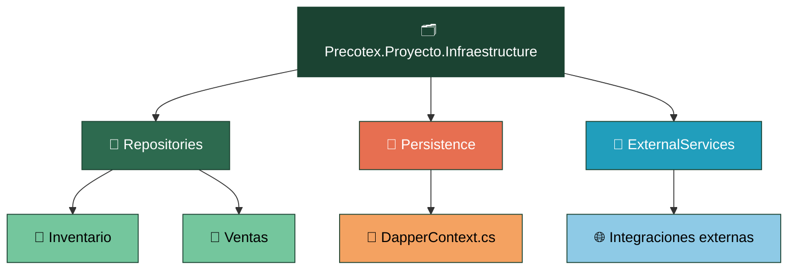
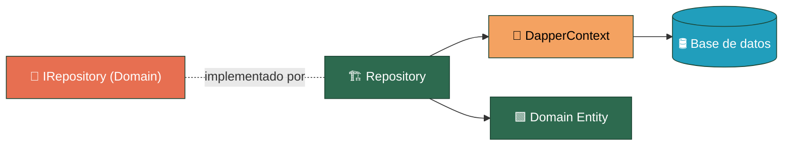

# Precotex Proyecto Infraestructure

## Descripción

Capa encargada de implementar los detalles técnicos externos de la aplicación.
Depende de `Precotex.Proyecto.Domain` para implementar contratos de persistencia (`IRepository`) y encapsular el acceso a datos mediante Dapper.
Contiene implementaciones concretas de infraestructura, sin incluir reglas de negocio.

## Estructura

---

## Responsabilidades

| Carpeta | Responsabilidad |
|---|---|
| `Repositories/{Modulo}/` | Implementación concreta de contratos de persistencia definidos en Domain |
| `Persistence/` | Configuración de acceso a datos (`DapperContext`) |
| `ExternalServices/` | Integraciones con servicios externos (correo, storage, etc.) |

---

## Flujo

`Infrastructure Repository` implementa los contratos `IRepository` definidos por `Domain`.
Utiliza Dapper y los componentes de persistencia para acceder a datos, transformando los resultados obtenidos en entidades del dominio.
Los detalles técnicos de acceso a datos permanecen encapsulados dentro de esta capa.

---

## Dependencias

Infrastructure depende de:

- Domain

Implementa contratos de persistencia definidos por Domain.

No es referenciada directamente por API ni Application; sus implementaciones son registradas mediante inyección de dependencias.

---

## Qué NO pertenece aquí

| No colocar | Corresponde a |
|---|---|
| DTOs de API | `Application` |
| Contratos de negocio (IService) | `Application` |
| Reglas de negocio | `Domain` |
| Contratos de persistencia (IRepository) | `Domain` |

---

## Referencias

Ver arquitectura general en [docs/arquitectura.md](../../docs/arquitectura.md).
