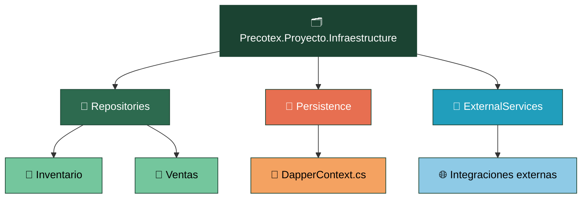
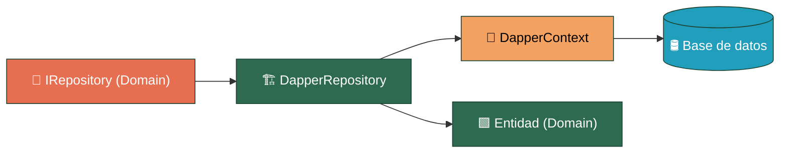

# Precotex Proyecto Infraestructure

## Descripción

Depende de `Precotex.Proyecto.Domain` (implementa sus contratos de persistencia, `IRepository`) y de `Precotex.Proyecto.Application` (implementa sus contratos de orquestación). Implementa lo que Domain y Application definen como interfaz: **cómo** se resuelve el acceso a datos y los servicios externos, nunca **qué** se necesita.

## Estructura

---

## Responsabilidades

| Carpeta | Contiene | SOLID |
|---|---|---|
| `Repositories/{Modulo}/` | Implementación concreta (Dapper) de las interfaces definidas en Domain, organizadas por módulo de negocio | DIP / LSP |
| `Persistence/` | Conexión y contexto de acceso a datos (`DapperContext`) | SRP |
| `ExternalServices/` | Integraciones con servicios externos (correo, storage, etc.) | SRP / ISP |

---

## Flujo

`DapperRepository` implementa el `IRepository` definido en `Domain`, usa `DapperContext` para acceder a la base de datos y mapea las filas obtenidas a la Entidad de `Domain`. Nunca expone tipos propios de Dapper (`IDbConnection`, `DynamicParameters`, etc.) fuera de esta capa.

---

## Dependencias

La capa Infraestructure puede depender de:

- Domain
- Application

No debe ser referenciada por ninguna otra capa: Domain, Application y Api no conocen sus implementaciones concretas, solo las interfaces que Infraestructure implementa.

**Alarma:** repositorio devuelve/recibe tipo propio de Dapper en vez de Entidad. Fuga de abstracción.

---

## Qué NO pertenece aquí

| No colocar | Corresponde a |
|---|---|
| Reglas de negocio | `Domain` |
| Validación de entrada | `Application` |
| Definición de contratos (`IRepository`, interfaces de orquestación) | `Domain` / `Application` |
| `HttpContext`, `IActionResult` | `Api` |
| DTO de entrada/salida (siempre debe recibir/devolver Entidad) | `Application` |

---

## Referencias

Ver arquitectura general en [docs/arquitectura.md](../../docs/arquitectura.md).
