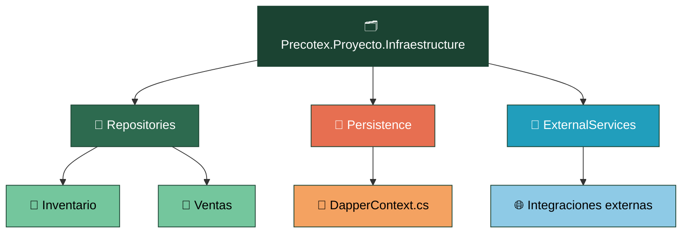
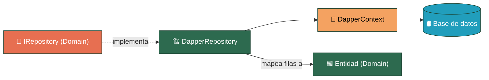

# Precotex Proyecto Infraestructure

Depende de `Precotex.Proyecto.Domain` (implementa sus contratos de persistencia, `IRepository`) y de `Precotex.Proyecto.Application` (implementa sus contratos de orquestación). Implementa lo que Domain y Application definen como interfaz: **cómo** se resuelve el acceso a datos y los servicios externos, nunca **qué** se necesita.

## Estructura

## Flujo: implementación de un repositorio con Dapper

`DapperRepository` solo conoce el `IRepository` que implementa y la entidad de `Domain` que devuelve. Nunca expone tipos propios de Dapper (`IDbConnection`, `DynamicParameters`, etc.) fuera de esta capa.

## Carpeta → contenido → SOLID

| Carpeta | Contiene | SOLID |
|---|---|---|
| `Repositories/{Modulo}/` | Implementación concreta (Dapper) de las interfaces definidas en Domain, organizadas por módulo de negocio | DIP / LSP |
| `Persistence/` | Conexión y contexto de acceso a datos (`DapperContext`) | SRP |
| `ExternalServices/` | Integraciones con servicios externos (correo, storage, etc.) | SRP / ISP |

## Alcance

| Corresponde a esta capa | No corresponde (¿dónde va?) |
|---|---|
| Implementación concreta de `IRepository` (Dapper) | Reglas de negocio / invariantes → `Domain` |
| Conexión y contexto de acceso a datos (`DapperContext`) | Validación de entrada → `Application` |
| Integraciones con servicios externos (correo, storage, pasarelas de pago) | Definir contratos (`IRepository`, interfaces de orquestación) — aquí solo se implementan, los define `Domain`/`Application` |
| Mapeo de filas de BD a Entidades de `Domain` | Exponer tipos propios de Dapper (`IDbConnection`, `DynamicParameters`) fuera de esta capa |
| Implementación de interfaces de orquestación definidas en `Application` | Tipos de ASP.NET Core (`HttpContext`, `IActionResult`) → `Api` |
| — | Recibir o devolver DTOs de `Application` (siempre entra/sale con Entidades de `Domain`) |

**Señal de alarma:** si un método público de un repositorio devuelve o recibe un tipo propio de Dapper en vez de una Entidad de `Domain`, esa fuga de abstracción rompe el contrato.

Ver detalle general de la arquitectura en [docs/arquitectura.md](../../docs/arquitectura.md).
