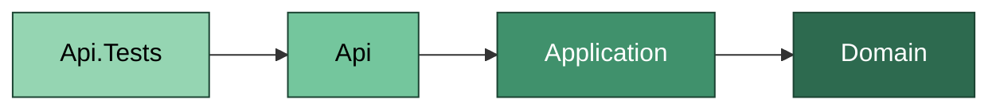
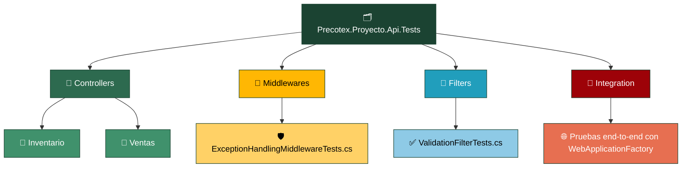
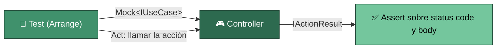

# Precotex Proyecto Api.Tests

Prueba `Precotex.Proyecto.Api`. La mayoría son pruebas unitarias de Controllers/Middlewares/Filters con los UseCases mockeados; opcionalmente, un subconjunto pequeño de pruebas de integración end-to-end con `WebApplicationFactory<Program>`.

## Estructura

## Flujo: prueba de un controller

El test de Controller mockea el UseCase que la acción invoca, llama al método del controller directamente (sin levantar el pipeline HTTP) y verifica el `IActionResult` (código de estado, tipo, contenido). No prepara reglas de negocio: si tuviera que hacerlo, el Controller estaría conteniendo lógica que le corresponde a `Application`.

`Middlewares/` y `Filters/` se prueban de forma aislada, sin Controller real: se invoca el middleware/filter directamente con un `HttpContext` simulado y se verifica su efecto (código de estado, cuerpo de la respuesta, si el pipeline continúa o corta).

`Integration/` es el único lugar de esta carpeta con pruebas de extremo a extremo (`WebApplicationFactory<Program>`, pipeline HTTP real, base de datos de test): deliberadamente pocas, para casos críticos de negocio de punta a punta.

## Carpeta → contenido → SOLID

| Carpeta | Contiene | SOLID que valida |
|---|---|---|
| `Controllers/{Modulo}/` | Un archivo de test por controller, con el/los UseCase mockeados | SRP / DIP — un controller sin lógica de negocio es fácil (y rápido) de testear con un solo mock |
| `Middlewares/` | Tests aislados del pipeline de manejo de excepciones | SRP |
| `Filters/` | Tests aislados de filtros de validación/auditoría | SRP |
| `Integration/` | Pruebas end-to-end acotadas a flujos críticos | — |

Ver la estrategia general de pruebas en [tests/README.md](../README.md).
