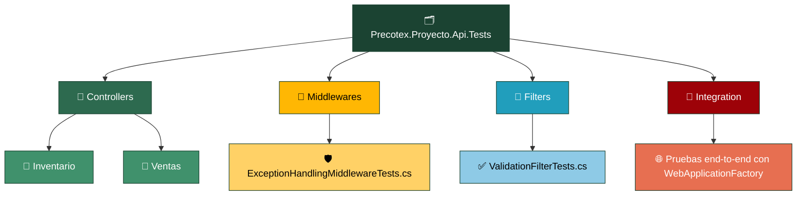
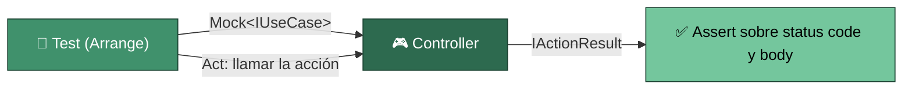
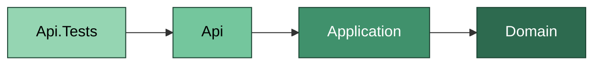

# Precotex Proyecto Api.Tests

## Descripción

Contiene pruebas automatizadas de la capa `Api`. 
Principalmente pruebas unitarias de Controllers, Middlewares y Filters con dependencias mockeadas, además de un conjunto reducido de pruebas de integración end-to-end con `WebApplicationFactory<Program>`.

## Estructura

---

## Responsabilidades

| Carpeta | Responsabilidad |
|---|---|
| `Controllers/{Modulo}/` | Tests unitarios de Controllers con UseCases mockeados | 
| `Middlewares/` | Tests aislados del pipeline HTTP | 
| `Filters/` | Tests de validaciones transversales | 
| `Integration/` | Flujos completos con pipeline real | 

---

## Flujo

El test de Controller mockea el UseCase que la acción invoca, llama al método del controller directamente (sin levantar el pipeline HTTP) y verifica el `IActionResult` (código de estado, tipo, contenido). No prepara reglas de negocio: si tuviera que hacerlo, el Controller estaría conteniendo lógica que le corresponde a `Application`.

`Middlewares/` y `Filters/` se prueban de forma aislada, sin Controller real: se invoca el middleware/filter directamente con un `HttpContext` simulado y se verifica su efecto (código de estado, cuerpo de la respuesta, si el pipeline continúa o corta).

`Integration/` es el único lugar de esta carpeta con pruebas de extremo a extremo (`WebApplicationFactory<Program>`, pipeline HTTP real, base de datos de test): deliberadamente pocas, para casos críticos de negocio de punta a punta.

---

## Dependencias

`Api.Tests` referencia únicamente `Api` (y, transitivamente, `Application` y `Domain`). Nunca referencia `Infraestructure.Tests` ni ningún otro proyecto de test.

---

## Qué NO pertenece aquí

| No colocar | Corresponde a |
|---|---|
| Pruebas de reglas de negocio | `Domain.Tests` |
| Pruebas de UseCases/Validators | `Application.Tests` |
| Pruebas de repositorios/acceso a datos real | `Infraestructure.Tests` |
| Datos de negocio complejos para levantar un Controller | señal de que el Controller tiene lógica que corresponde a `Application` |

---

## Referencias

Ver la estrategia general de pruebas en [tests/README.md](../README.md).
Ver la capa que prueba en [src/Precotex.Proyecto.Api/README.md](../../src/Precotex.Proyecto.Api/README.md).
