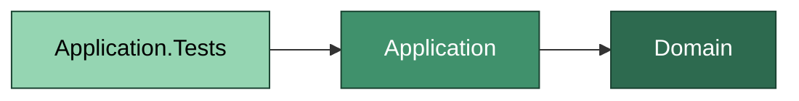
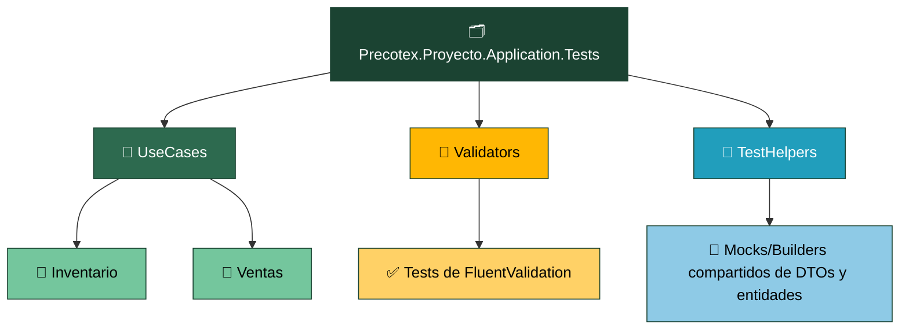
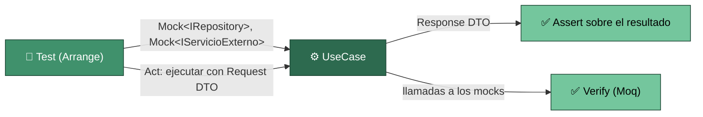

# Precotex Proyecto Application.Tests

Prueba `Precotex.Proyecto.Application`. Referencia `Application` (y transitivamente `Domain`). Usa Moq para los contratos que el UseCase consume por inyección: `IRepository` (definido en Domain) e interfaces de orquestación (definidas en Application).

## Estructura

## Flujo: prueba de un caso de uso

El test construye los mocks de las interfaces que el UseCase recibe por constructor (`Mock<IPedidoRepository>`, etc.), configura el comportamiento esperado (`Setup`), ejecuta el caso de uso con un Request DTO y verifica dos cosas: el Response DTO devuelto (`Assert`), y opcionalmente que el UseCase llamó a las dependencias correctas (`Verify`). Nunca instancia una clase concreta de Infraestructure — si tuviera que hacerlo, el UseCase estaría acoplado a una implementación concreta.

`Validators/` se prueba sin mocks: cada test alimenta el validator con un DTO válido/inválido y verifica el resultado (`IsValid`, lista de errores).

## Carpeta → contenido → SOLID

| Carpeta | Contiene | SOLID que valida |
|---|---|---|
| `UseCases/{Modulo}/` | Un archivo de test por UseCase, con mocks de `IRepository` (Domain) e interfaces de orquestación (Application) | DIP — si un UseCase no se puede mockear sin referenciar Infraestructure, la dependencia está invertida |
| `Validators/` | Un archivo de test por Validator, casos válidos e inválidos | SRP — cada Validator prueba un único DTO |
| `TestHelpers/` | Builders de DTOs/entidades y helpers de configuración de mocks reutilizables entre UseCases | SRP (de los propios tests) |

Ver la estrategia general de pruebas en [tests/README.md](../README.md).
