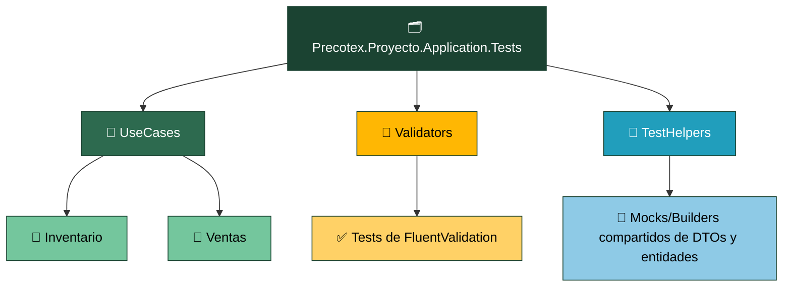
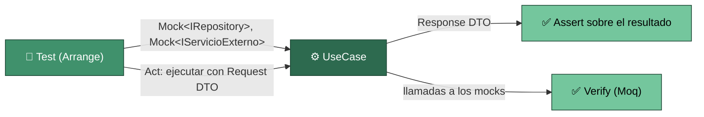
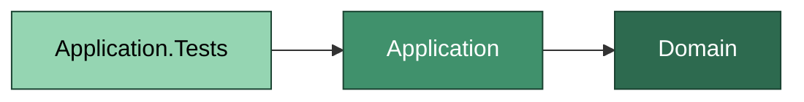

# Precotex Proyecto Application.Tests

## Descripción

Contiene pruebas automatizadas de la capa `Precotex.Proyecto.Application`.
Valida el comportamiento de los casos de uso, servicios de aplicación y validadores, aislando sus dependencias mediante mocks.
Referencia únicamente `Application` (y transitivamente `Domain`). Utiliza Moq para simular contratos consumidos por inyección de dependencias como repositorios e interfaces externas.

## Estructura

---

## Responsabilidades

| Carpeta | Responsabilidad |
|---|---|
| `UseCases/{Modulo}/` | Tests unitarios de casos de uso con repositorios y servicios mockeados |
| `Validators/` | Tests de validación de DTOs | 
| `TestHelpers/` | Builders y configuraciones reutilizables para tests | 

---

## Flujo

El test construye los mocks de las interfaces que el UseCase recibe por constructor (`Mock<IPedidoRepository>`, etc.), configura el comportamiento esperado (`Setup`), ejecuta el caso de uso con un Request DTO y verifica dos cosas: el Response DTO devuelto (`Assert`), y opcionalmente que el UseCase llamó a las dependencias correctas (`Verify`). Nunca instancia una clase concreta de Infraestructura — si tuviera que hacerlo, el UseCase estaría acoplado a una implementación concreta.

`Validators/` se prueba sin mocks: cada test alimenta el validator con un DTO válido/inválido y verifica el resultado (`IsValid`, lista de errores).

---

## Dependencias

`Application.Tests` referencia únicamente `Application` (y, transitivamente, `Domain`). Nunca referencia `Api`, `Infraestructure` ni ningún otro proyecto de test.

---

## Qué NO pertenece aquí

| No colocar | Corresponde a |
|---|---|
| Pruebas de reglas de negocio de entidades | `Domain.Tests` |
| Pruebas de Controllers, Middlewares, Filters | `Api.Tests` |
| Pruebas contra base de datos real (sin mocks) | `Infraestructure.Tests` |
| Instanciar una clase concreta de Infraestructure en el test | señal de que el UseCase rompe DIP |

---

## Referencias

Ver la estrategia general de pruebas en [tests/README.md](../README.md).
Ver la capa que prueba en [src/Precotex.Proyecto.Application/README.md](../../src/Precotex.Proyecto.Application/README.md).
