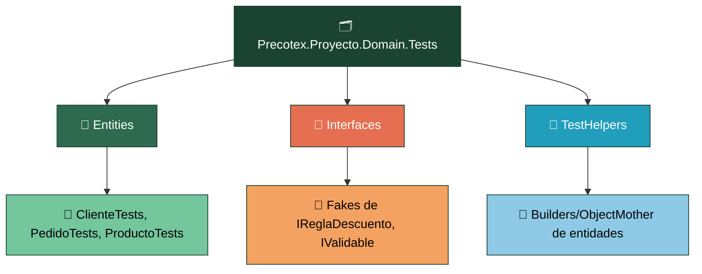
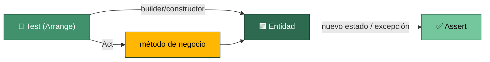
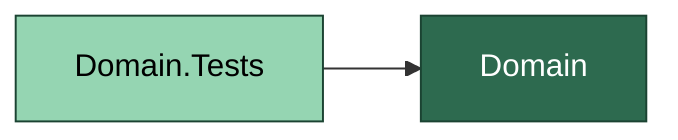

# Precotex Proyecto Domain.Tests

## Descripción

Contiene pruebas automatizadas de la capa `Precotex.Proyecto.Domain`.
Valida reglas de negocio, invariantes y comportamiento interno de las entidades sin dependencias externas.
No referencia ninguna otra capa de la solución: al ser un dominio puro, sus pruebas tampoco requieren infraestructura, persistencia ni servicios externos.

## Estructura

---

## Responsabilidades

| Carpeta | Responsabilidad |
|---|---|
| `Entities/` | Tests de reglas de negocio e invariantes de entidades |
| `Fakes/` | Implementaciones simples de interfaces propias del dominio |
| `TestHelpers/` | Builders/Object Mother para crear escenarios válidos |

---

## Flujo

Cada test instancia la entidad (directamente o vía un builder de `TestHelpers/`), invoca un método de negocio y verifica el nuevo estado o la excepción lanzada. No hay mocks: si una entidad los necesitara, dejaría de ser Domain puro.

Los `Interfaces/` de Domain (`IReglaDescuento`, `IValidable`) se prueban con **fakes** escritos a mano (clases pequeñas que implementan la interfaz con comportamiento fijo para el test), no con Moq — no hay nada que "verificar que fue llamado", solo comportamiento a probar.

---

## Dependencias

`Domain.Tests` no referencia ninguna otra capa ni proyecto de test: es el único proyecto de pruebas sin dependencias externas al código que prueba.

---

## Qué NO pertenece aquí

| No colocar | Corresponde a |
|---|---|
| Mocks de `IRepository` u otras dependencias externas | `Application.Tests` (si una entidad los necesita, rompe la regla de Domain) |
| Pruebas de UseCases, Validators | `Application.Tests` |
| Pruebas de acceso a datos real | `Infraestructure.Tests` |
| Pruebas de Controllers, Middlewares, Filters | `Api.Tests` |
| Lógica condicional (`if`, loops) dentro de un test | usar `[Theory]`/`[InlineData]` |

---

## Referencias

Ver la estrategia general de pruebas en [tests/README.md](../README.md).
Ver la capa que prueba en [src/Precotex.Proyecto.Domain/README.md](../../src/Precotex.Proyecto.Domain/README.md).
