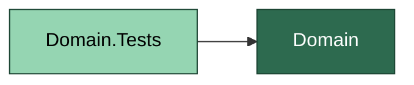
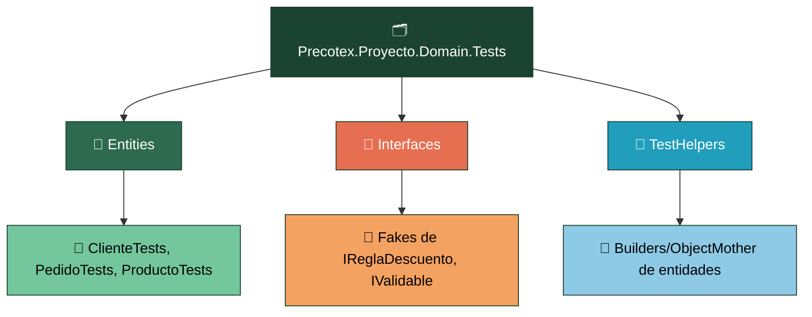
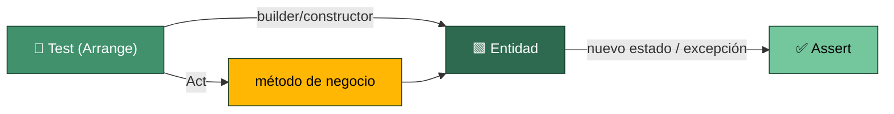

# Precotex Proyecto Domain.Tests

Prueba `Precotex.Proyecto.Domain`. No referencia ninguna otra capa: las entidades no tienen dependencias externas, así que sus tests tampoco las necesitan.

## Estructura

## Flujo: prueba de una entidad

Cada test instancia la entidad (directamente o vía un builder de `TestHelpers/`), invoca un método de negocio y verifica el nuevo estado o la excepción lanzada. No hay mocks: si una entidad los necesitara, dejaría de ser Domain puro.

Los `Interfaces/` de Domain (`IReglaDescuento`, `IValidable`) se prueban con **fakes** escritos a mano (clases pequeñas que implementan la interfaz con comportamiento fijo para el test), no con Moq — no hay nada que "verificar que fue llamado", solo comportamiento a probar.

## Carpeta → contenido → SOLID

| Carpeta | Contiene | SOLID que valida |
|---|---|---|
| `Entities/` | Un archivo de test por entidad, con un test por regla de negocio/invariante | SRP — si el test de una entidad crece demasiado, la entidad probablemente tiene más de una responsabilidad |
| `Interfaces/` | Fakes de las interfaces de reglas de negocio puras | ISP / DIP — una interfaz fácil de fakear es una interfaz pequeña y bien enfocada |
| `TestHelpers/` | Builders/Object Mother para construir entidades válidas sin repetir setup en cada test | SRP (de los propios tests) |

Ver la estrategia general de pruebas en [tests/README.md](../README.md).
