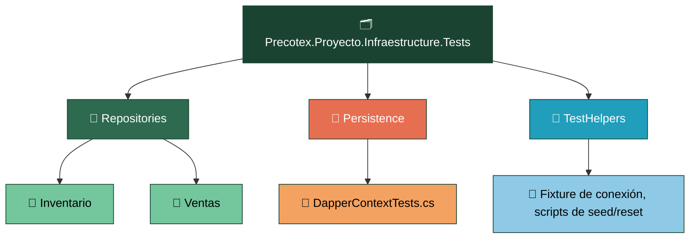
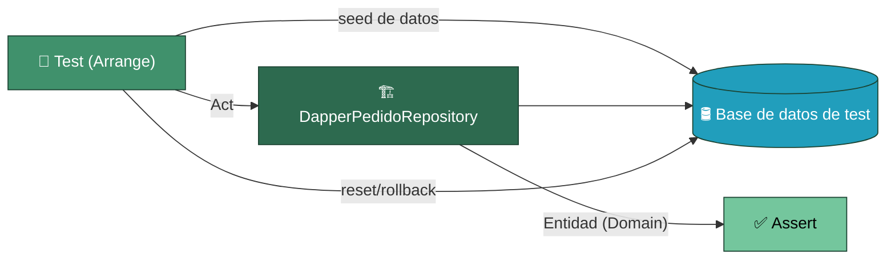
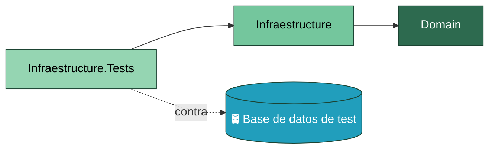

# Precotex Proyecto Infraestructure.Tests

## Descripción

Contiene pruebas automatizadas de la capa `Precotex.Proyecto.Infrastructure`.
Son pruebas de integración enfocadas en validar el acceso real a datos mediante Dapper.
Se ejecutan contra una base de datos de prueba (LocalDB o contenedor), validando consultas SQL, mapeo de entidades y comportamiento de los repositorios.
No utiliza mocks de persistencia, ya que el objetivo es verificar la integración real entre código, SQL y base de datos.

## Estructura

---

## Responsabilidades

| Carpeta | Responsabilidad | 
|---|---|
| `Repositories/{Modulo}/` | Tests de integración de repositorios contra BD real |
| `Persistence/` | Tests de conexión y configuración de Dapper |
| `TestHelpers/` | Fixtures, seed y limpieza de datos de prueba |

---

## Flujo

Cada test siembra el estado necesario en la base de datos de test, ejecuta el método del repositorio y verifica que la entidad de `Domain` devuelta sea correcta. Al finalizar (o al iniciar) el test se revierte el cambio — por transacción con rollback o por reseteo del esquema — para que los tests no dependan del orden de ejecución ni entre sí.

Si dos implementaciones distintas de `IPedidoRepository` existieran (por ejemplo, Dapper y en memoria para tests rápidos), ambas deberían pasar exactamente el mismo conjunto de tests de contrato — es la prueba práctica de que son sustituibles entre sí.

---

## Dependencias

`Infraestructure.Tests` referencia `Infraestructure` (y, transitivamente, `Domain`), y se ejecuta contra una base de datos de test real.

---

## Qué NO pertenece aquí

| No colocar | Corresponde a |
|---|---|
| Pruebas de reglas de negocio | `Domain.Tests` |
| Pruebas de UseCases/Validators | `Application.Tests` |
| Pruebas de Controllers, Middlewares, Filters | `Api.Tests` |
| Mocks de Dapper o del acceso a datos | no aporta valor aquí — usar base de datos real de test |
| Lógica condicional (`if`, loops) dentro de un test | usar `[Theory]`/`[InlineData]` |

---

## Referencias

Ver la estrategia general de pruebas en [tests/README.md](../README.md).
Ver la capa que prueba en [src/Precotex.Proyecto.Infraestructure/README.md](../../src/Precotex.Proyecto.Infraestructure/README.md).
