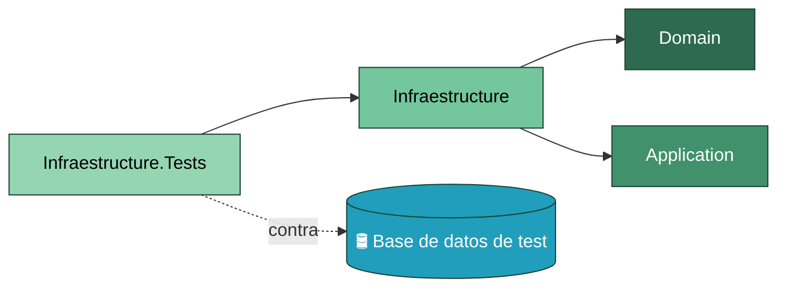
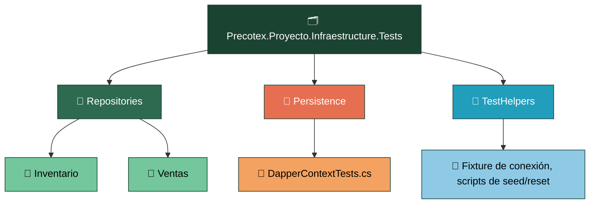
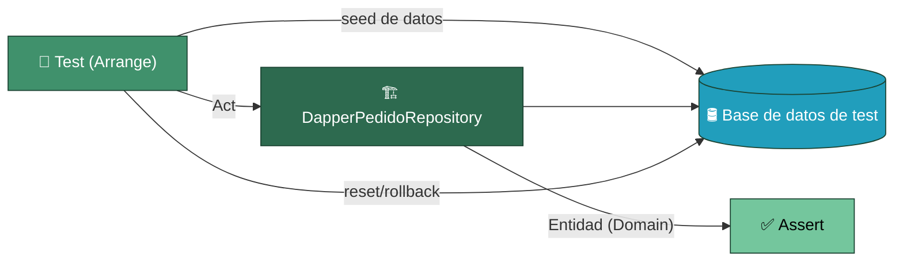

# Precotex Proyecto Infraestructure.Tests

Prueba `Precotex.Proyecto.Infraestructure`. Son pruebas de integración: se ejecutan contra una base de datos real de test (LocalDB o contenedor), nunca contra mocks — mockear Dapper no probaría nada sobre el SQL real.

## Estructura

## Flujo: prueba de un repositorio Dapper

Cada test siembra el estado necesario en la base de datos de test, ejecuta el método del repositorio y verifica que la entidad de `Domain` devuelta sea correcta. Al finalizar (o al iniciar) el test se revierte el cambio — por transacción con rollback o por reseteo del esquema — para que los tests no dependan del orden de ejecución ni entre sí.

Si dos implementaciones distintas de `IPedidoRepository` existieran (por ejemplo, Dapper y en memoria para tests rápidos), ambas deberían pasar exactamente el mismo conjunto de tests de contrato — es la prueba práctica de que son sustituibles entre sí.

## Carpeta → contenido → SOLID

| Carpeta | Contiene | SOLID que valida |
|---|---|---|
| `Repositories/{Modulo}/` | Tests de integración por repositorio, contra base de datos real | LSP — cualquier implementación de la interfaz debe pasar el mismo contrato de test |
| `Persistence/` | Tests de `DapperContext`: apertura/cierre de conexión, manejo de errores de conexión | SRP |
| `TestHelpers/` | Fixture de conexión a la BD de test, scripts de seed y limpieza compartidos | SRP (de los propios tests) |

Ver la estrategia general de pruebas en [tests/README.md](../README.md).
