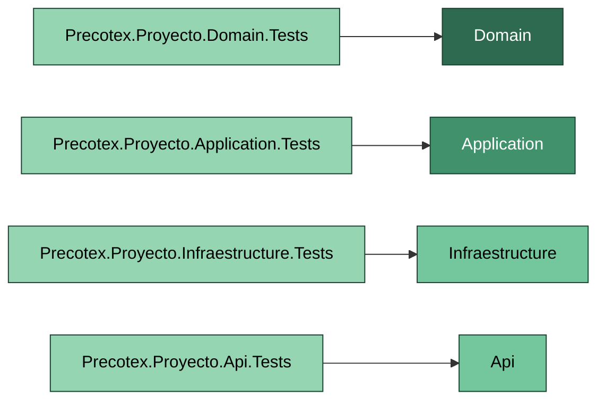
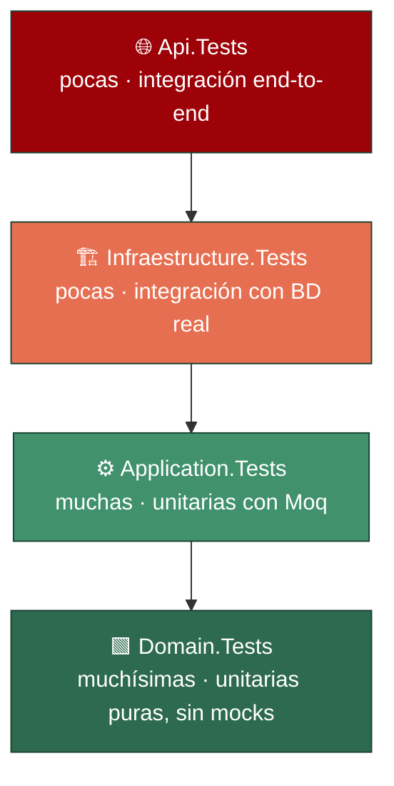

# Precotex Proyecto — Tests

Carpeta de pruebas automatizadas de la solución. Cada capa de `src/` tiene su proyecto de test correspondiente, que depende únicamente de la capa que prueba (y de las dependencias transitivas de esa capa), nunca al revés.

> Esta carpeta documenta la estructura de pruebas planificada. Al igual que `src/`, los `.csproj` aún no están creados: xUnit y Moq quedan fijados aquí como estándar (ver [README.md](../README.md#tecnologías-utilizadas)) y se incorporarán junto con el código de cada capa.

## Estructura

```
tests/
├── Precotex.Proyecto.Domain.Tests           # Pruebas unitarias puras de Domain: entidades, reglas de negocio, interfaces de dominio
├── Precotex.Proyecto.Application.Tests      # Pruebas unitarias de UseCases y Validators, con Moq de IRepository e interfaces de orquestación
├── Precotex.Proyecto.Infraestructure.Tests  # Pruebas de integración de repositorios Dapper y DapperContext contra base de datos real
└── Precotex.Proyecto.Api.Tests              # Pruebas de Controllers, Middlewares y Filters; integración end-to-end opcional con WebApplicationFactory
```

**Regla de dependencia:** cada proyecto de test referencia solo el proyecto de `src/` que prueba (nunca otro proyecto de test, nunca una capa "de arriba"). `Precotex.Proyecto.Application.Tests` referencia `Application` (y transitivamente `Domain`), pero no referencia `Infraestructure` ni `Api`.



## Pirámide de pruebas

La proporción de pruebas sigue la pirámide clásica: muchas y rápidas en Domain, cada vez menos (y más lentas) a medida que se acercan a la infraestructura real.



## Proyecto de test → qué prueba → herramientas

| Proyecto | Prueba | Dobles de prueba | Herramientas |
|---|---|---|---|
| `Domain.Tests` | Entidades, reglas de negocio, invariantes | Ninguno (o fakes manuales para interfaces como `IReglaDescuento`) | xUnit, FluentAssertions (opcional) |
| `Application.Tests` | UseCases, Validators | Moq de `IRepository` (Domain) e interfaces de orquestación (Application) | xUnit, Moq |
| `Infraestructure.Tests` | Repositorios Dapper, `DapperContext` | Base de datos real de test (LocalDB / contenedor), sin mocks | xUnit, base de datos de integración |
| `Api.Tests` | Controllers, Middlewares, Filters | Moq de los UseCases que consume el controller | xUnit, Moq, `WebApplicationFactory<Program>` (integración opcional) |

## Convenciones

- **Nombre de clase de test:** `{ClaseBajoPrueba}Tests` (ej. `PedidoTests`, `CrearPedidoUseCaseTests`).
- **Nombre de método:** `{Método}_{Escenario}_{ResultadoEsperado}` (ej. `AgregarItem_ConCantidadNegativa_LanzaExcepcion`).
- **Patrón:** Arrange-Act-Assert (AAA), con las tres secciones separadas por una línea en blanco.
- **Un assert lógico por test** — varios `Assert`/`Should()` están bien si verifican la misma afirmación (ej. varias propiedades de un mismo objeto resultado).
- **Sin lógica condicional en los tests** (`if`, loops sobre casos): cada escenario es un test propio, o un `[Theory]`/`[InlineData]` si el cuerpo es idéntico y solo cambian los datos.

## SOLID: qué valida cada capa de test

Los tests no solo verifican comportamiento: son la prueba práctica de que cada capa respeta los principios documentados en su propio README (`src/*/README.md`). Si un test se vuelve difícil de escribir sin tocar una capa que no debería, normalmente es una señal de que el principio se rompió en el código, no en el test.

| Proyecto de test | Qué demuestra si es fácil de escribir | Qué señala si es difícil de escribir | SOLID |
|---|---|---|---|
| `Domain.Tests` | Las entidades no requieren mocks ni infraestructura para probarse | Si una entidad necesita un mock, tiene una dependencia externa que no debería (rompe la regla de Domain) | SRP |
| `Application.Tests` | El UseCase se puede probar mockeando solo interfaces (`IRepository`, interfaces de orquestación) | Si hace falta referenciar una clase concreta de Infraestructure para instanciar el UseCase, la dependencia está invertida | DIP / ISP |
| `Infraestructure.Tests` | Cualquier implementación de `IRepository` se puede probar con el mismo contrato de test (mismos casos, misma aserción sobre el resultado) | Si una implementación concreta exige un test distinto para cumplir el mismo contrato, viola la sustitución | LSP |
| `Api.Tests` | El Controller se prueba mockeando el UseCase, sin lógica de negocio propia que probar | Si el test de Controller necesita preparar datos de negocio complejos, el Controller está haciendo más de lo que le corresponde | SRP / DIP |

---

## Referencias

Ver arquitectura general en [docs/arquitectura.md](../docs/arquitectura.md).
Ver el detalle de cada capa en `src/{Proyecto}/README.md` y su contraparte de test en `tests/{Proyecto}.Tests/README.md`.
